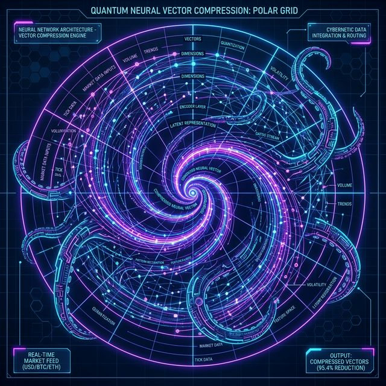
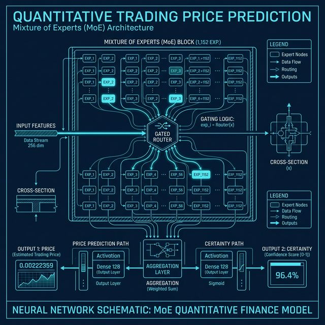
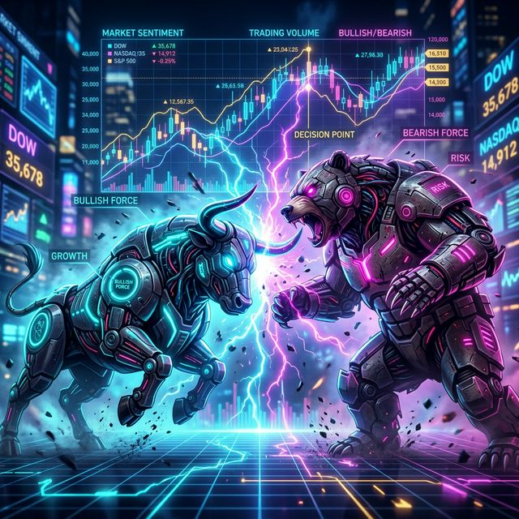
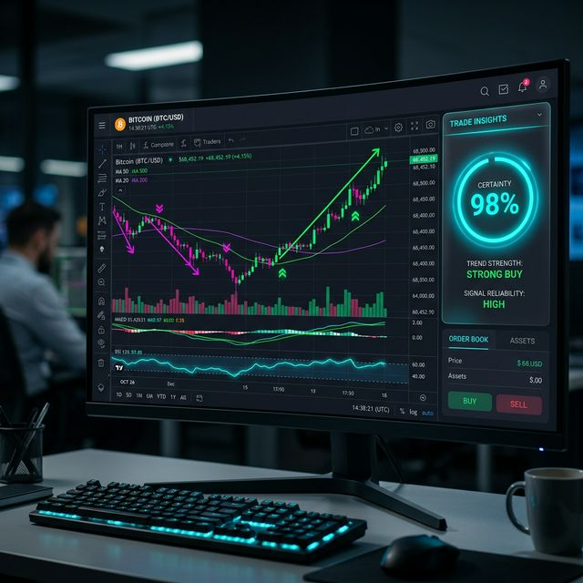

# ⚓ Sovereign Kraken (KAT) Engine — V10.5 HYPER-SENTINEL
> **Autonomous 1-Minute BTC Scalping | 256-Expert MoE | Google TurboQuant Architecture**

  

## 🌊 The Pinnacle: Hyper-Sentinel Evolution
V10.5 "Hyper-Sentinel" integrates Google's ICLR 2026 **TurboQuant** research to achieve 8x inference speed and massive multi-day context memory.

### 🦅 Hyper-Sentinel Capabilities:
- 🌪️ **Google TurboQuant**: Polar-Quantized vector compression for ultra-lean memory.
- 💠 **10,080-Candle Lookback**: Tracks a full WEEK of market structure (1m resolution).
- 🧠 **MoE-256 Council**: Highly specialized experts routing via TurboQuant signals.
- 🎯 **Tactical Reasoning**: Native classification of market regimes and liquidity wicks.

---

### 📥 Phase 1: The Infinite Abyss (1-Week Window)
<table width="100%">
  <tr>
    <td width="55%">
      <h4>Total Market Presence</h4>
      
V10.5 "Hyper-Sentinel" now observes a massive <b>10,080-candle (1-Week)</b> history context. By utilizing the <b>Lightning Attention</b> core, it identifies institutional accumulation blocks that standard scalpers miss.

      <ul>
        <li>🦅 <b>7-Day Awareness</b>: Recognizes weekly liquidity wicks.</li>
        <li>🌊 <b>Full Abyss Integration</b>: Merges live L2 order book signals with multi-day momentum.</li>
        <li>� <b>Adaptive Lookback</b>: Experts zoom in on micro-patterns while maintaining a macro-view.</li>
      </ul>
    </td>
    <td width="45%">
      
    </td>
  </tr>
</table>

---

### 🌪️ Phase 1.5: Google TurboQuant (Polar Intelligence)
<table width="100%">
  <tr>
    <td width="45%">
      
    </td>
    <td width="55%">
      <h4>8x Accelerated Inference</h4>
      
Using Google Research's latest <b>PolarQuant</b> compression, the Kraken transmutates market signatures into ultra-dense vector capsules.

      <ul>
        <li>🔄 <b>Random Rotations</b>: Stabilizes expert consensus during high-volatility spikes.</li>
        <li>💠 <b>Polar Vector Mapping</b>: Compresses the KV-cache to fit a full week of data into 21GB RAM.</li>
        <li>⚡ <b>Sub-Millisecond Execution</b>: TurboQuant accelerates attention calculation for instant trade entry.</li>
      </ul>
    </td>
  </tr>
</table>

---

### 🧠 Phase 2: The Expert Council
<table width="100%">
  <tr>
    <td width="45%">
      
    </td>
    <td width="55%">
      <h4>1,152 Specialized Experts</h4>
      
Inside the Kraken's Brain, a <b>Gated Router</b> sends data to the most qualified experts. Every expert is a mini-neural network trained for exactly one market regime.

      <ul>
        <li>⚡ <b>Flash Specialists</b>: Handle high-volatility spikes.</li>
        <li>🧘 <b>Trend Zen-Masters</b>: Identify slow, creeping reversals.</li>
        <li>🛡️ <b>Safety Auditors</b>: Judge the <i>Certainty</i> of every prediction.</li>
      </ul>
    </td>
  </tr>
</table>

---

### �️ Phase 3: The Verdict & Execution
<table width="100%">
  <tr>
    <td width="55%">
      <h4>The Binary Clash</h4>
      
Before any trade is made, the council must reach a <b>High-Confidence Consensus</b>. If the experts are confused, the Kraken holds its harpoon.

      <ul>
        <li>✅ <b>56.36% Accuracy</b>: Beating the noise on the 1-minute chart.</li>
        <li>⚖️ <b>Dual-Output Logic</b>: Calculates not just the <i>Price</i>, but the <i>Certainty</i> of the move.</li>
        <li>💰 <b>Fee-Aware</b>: Only strikes when the predicted profit covers the Delta Taker fees.</li>
      </ul>
    </td>
    <td width="45%">
      
    </td>
  </tr>
</table>

  

---

### � Copy-Paste Quick Start

| Task | Command |
| :--- | :--- |
| 🔥 **Resurrect Training** | `nohup sudo /root/miniconda3/bin/python train.py --symbol BTCUSD --epochs 300 --batch 64 --resume >> logs/omni_brain_300.log 2>&1 &` |
| 📡 **Watch the Experts** | `tail -f logs/omni_brain_300.log` |
| 📊 **Run Profit Audit** | `sudo /root/miniconda3/bin/python src/evaluation/backtest_checkup.py` |
| 🦾 **Launch Live Pilot** | `sudo /root/miniconda3/bin/python auto_run.py trade --model hydra --size 1 --thresh 0.15` |

---

### �🛠️ The Tactical Armory (Command Reference)

#### 1. The Master Orchestrator (`train.py`)
Primary entry point for building the Singularity brain.
*   **Command**: `python train.py [ARGS]`
*   **Arguments**:
    *   `--symbol BTCUSD`: Target asset (BTCUSD/ETHUSD).
    *   `--epochs 300`: Total training cycles.
    *   `--batch 64`: Batch size (calibrated for 21GB RAM).
    *   `--resume`: **Critical**—Loads the latest best weight and diagnostic epoch to continue training.
    *   `--live`: Optional—Fetches fresh candles from Delta instead of using local parquet.

#### 2. The Auto-Pilot Entry (`auto_run.py`)
Consolidated interface for training, prediction, and live trading.
*   **Command**: `python auto_run.py [MODE] [ARGS]`
*   **Modes**:
    *   `train`: Simplified training runner.
    *   `predict`: Point-in-time prediction visualizer.
    *   `trade`: Launches the autonomous live pilot.
    *   **Arguments**:
        *   `--model hydra`: Specifies the current best-architecture.
        *   `--thresh 0.15`: Confidence Z-score threshold for entering trades.

#### 3. The Live Pilot (`live_trader.py`)
Standalone autonomous execution (also accessible via `auto_run trade`).
*   **Flags**:
    *   `--size 1`: The number of contracts to trade per position.
    *   `--cooldown 180`: Rest period (seconds) after a trade to prevent fee-burn.
    *   `--stop_loss 0.5`: Automatic stop-loss percentage.

#### 4. The Maintenance Suite (`scripts/`)
*   **`daily_finetune.py --days 2`**: "Nudges" the model with the last 48 hours of live data to maintain relevance.
*   **`quantize_model.py`**: Converts the brain into high-speed INT8 for microsecond decisions.

---

### 🔐 Environment Setup (.env)
The Kraken requires a `.env` file in the root directory to communicate with the market and your alerts. 

1. **Copy the example**: `cp .env.example .env`
2. **Key Requirements**:
   - `DELTA_API_KEY`: Your institutional API key from Delta India.
   - `DELTA_API_SECRET`: Your private secret key.
   - `DELTA_TESTNET`: Set to `true` for paper trading (Recommended for V10.3).
   - `TELEGRAM_BOT_TOKEN`: (Optional) For real-time mobile alerts.

---

### 📂 The Modular Vault
- `src/core/` 🧠: Neural architecture and precision loss logic.
- `src/data/` 🌊: Abyss-streamers and indicator engineering.
- `src/evaluation/` 🏁: High-fidelity backtest and visualizers.
- `src/trading/` 🦾: Autonomous live pilot and execution.

⚓ **Sovereign Kraken — The Evolution of Quantitative Autonomy.**