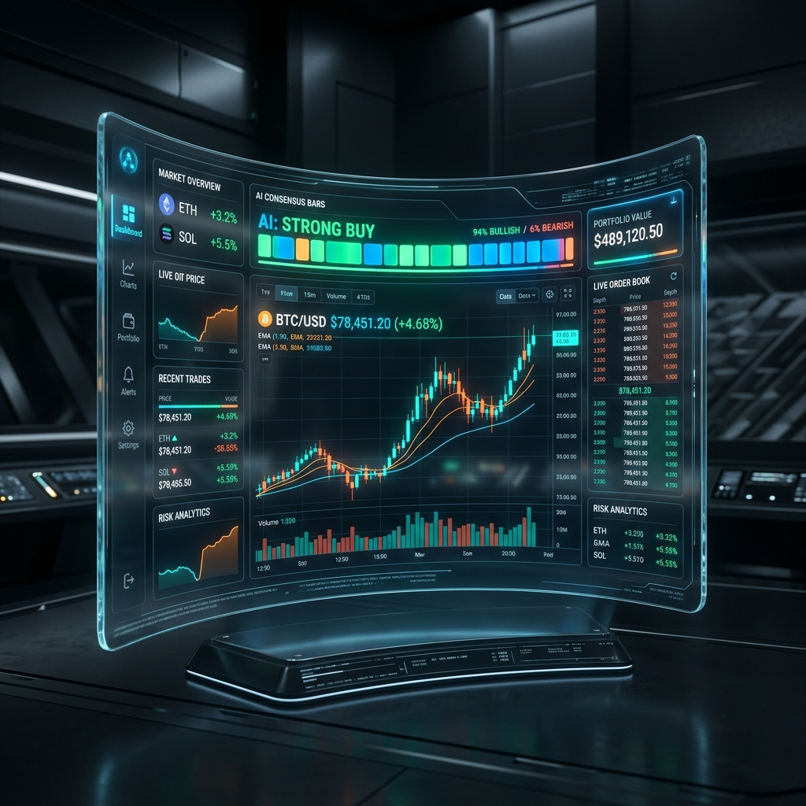

# ⚓ Sovereign Kraken Engine — V11.1 SOVEREIGN ALPHA 🏛️
> **Autonomous 15-Minute BTC Perpetual Futures Trading | 256-Expert MoE | Fee-Aware Reasoning (FAR) | Sovereign Goal Paradigm**

<p align="center">
  
</p>

---

## 🏛️ V11.1 "Sovereign Alpha — Phase 6"

V11.1 marks the evolution from simple prediction to **Sovereign Decision Making**. By integrating **Fee-Aware Reasoning (FAR)** directly into the model's neural weights, Iron Oracle no longer just predicts the market—it evaluates the **Business Case** for every trade.

### 🏛️ Sovereign Capabilities:
- 🛡️ **Fee-Aware Reasoning (FAR)**: Internal "Reasoning Head" distinguishes between **Sovereign Profit** and **Fee Traps**.
- 🎯 **Sovereign Goal Paradigm**: Model is trained to ignore "Noise" (small moves) and focus exclusively on signals with >2x Fee Advantage.
- ⚙️ **Dynamic Sovereign Config**: Centralized control over fees and "Greed Level" via `src/config/sovereign_config.py`.
- 🧠 **MLA + RoPE + MoE**: 256-Expert Mixture-of-Experts with **Rotary Positional Encoding** for 30-hour temporal context.
- 📉 **Perpetual Mastery**: Native support for Bi-Directional (Long/Short) trading with automated SL/TP brackets optimized for Perpetual funding and fees.

---

## 📐 Architecture Overview (V11.1)

```
Market Input (120 × 42 features)
       │
   [Dense → RMSNorm]       ← 42 → 128 embedding
       │
   ┌───┴──── × 8 ────────┐
   │    HydraBlock V11.1  │
   │  ┌─────────────────┐ │
   │  │  MLALayer+RoPE  │ │  ← time-aware latent attention
   │  │  GatedMoE-256   │ │  ← top-4 expert routing
   │  │  Dropout(0.1)   │ │  ← swing robustness
   │  └─────────────────┘ │
   └──────────────────────┘
       │
   Global Pooling → [Prediction] [Certainty] [Reasoning Head]
                                            (Fee-Aware Filter)
```

<p align="center">
  
  <br>
  <em>Fig 1: 256-Expert Mixture-of-Experts (MoE) Neural Hive</em>
</p>

---

## 🖥️ Sovereign Control Center
The V11.1 Dashboard provides a real-time window into the Kraken's decision-making process.

<p align="center">
  
</p>


---

## 📦 Sovereign Reasoning Labels
The model is now trained to classify every market condition into four "Business States":

| Class | Label | Meaning |
|-------|-------|---------|
| **0** | **SOVEREIGN_LONG** | Predicted Profit > 2x Fees (High Conviction) |
| **1** | **SOVEREIGN_SHORT** | Predicted Profit > 2x Fees (High Conviction) |
| **2** | **FEE_TRAP** | Direction correct, but move too small to cover fees |
| **3** | **NOISE** | Choppy / Sideways market (Stay in Cash) |

---

## 🌉 Genesis Bridge: Multi-Exchange Synchronization
To ensure "Best-in-Class" training, the Kraken utilizes a **Genesis Bridge** to synchronize history from multiple sources into a single "Ultimate Dataset."

### 🏛️ Historical Depth:
- **Total Candles**: 303,269 (15-Minute Resolution).
*   **Time Depth**: ~8.7 Years (August 2017 – Present).
*   **Sources**: Delta Exchange India + Binance Global.
- **Feature Synthesis**: Uses stochastic L2 simulation to reconstruct Order Book (OB) features for historical data lacking native depth.

### 🚀 Building the Foundation:
To rebuild the 303k Genesis dataset from scratch:
```bash
sudo /root/miniconda3/bin/python scripts/bridge_history.py
```
*Note: This script bridges the gap between Delta's local history and Binance's global archives.*

---

## 🚀 Quick Start Commands

| Task | Command |
| :--- | :--- |
| 🌉 **Run Genesis Bridge** | `sudo /root/miniconda3/bin/python scripts/bridge_history.py` |
| 🔥 **Sovereign Training (303k)** | `nohup sudo /root/miniconda3/bin/python -u train.py --candles 400000 --symbol BTCUSD --timeframe 15m --epochs 300 --batch 32 > logs/iron_oracle_v11.log 2>&1 &` |
| ◀️ **Start Dashboard (5000)** | `nohup sudo /root/miniconda3/bin/python -u auto_run.py serve --port 5000 > logs/dashboard.log 2>&1 &` |
| 📡 **Watch Live Status** | `tail -f logs/iron_oracle_v11.log` |
| 💰 **Run ROI Benchmark** | `sudo /root/miniconda3/bin/python scripts/calc_net_roi.py` |

---

## ⚙️ Sovereign Configuration (`src/config/sovereign_config.py`)
Modify these values to adapt to exchange changes instantly:
*   `CURRENT_FEE_PCT`: Update when exchange fees change (Default: 0.0006).
*   `SOVEREIGN_MULTIPLIER`: Your "Greed Level" (Default: 2.0x fee cover).

---

⚓ **Sovereign Kraken V11.1 "Iron Oracle" — Intelligence that understands Profit.**